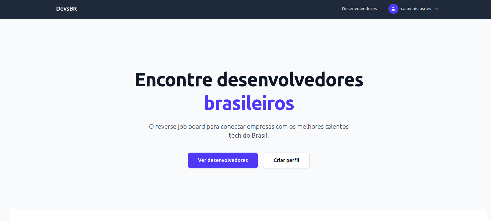

# DevsBR

> Reverse job board para conectar empresas com desenvolvedores brasileiros.



## Sobre o projeto

O DevsBR é uma plataforma onde desenvolvedores brasileiros criam perfis e aparecem para empresas que estão buscando talentos tech. Diferente dos job boards tradicionais, aqui os devs são os protagonistas.

## Funcionalidades

- **Para empresas**: Navegue perfis de desenvolvedores disponíveis e entre em contato diretamente pelos links (GitHub, Twitter, website)
- **Para desenvolvedores**: Crie seu perfil com foto, headline, bio e data de disponibilidade
- **Autenticação**: Cadastro e login com Devise
- **Upload de avatar**: Foto de perfil com preview em tempo real

## Tecnologias

- Ruby on Rails 8
- PostgreSQL
- Tailwind CSS
- Devise (autenticação)
- Pundit (autorização)
- Turbo + Stimulus
- Active Storage (avatars)

## Pré-requisitos

- Ruby 3.x
- PostgreSQL
- Node.js (para assets)

## Como rodar

```bash
# Clone o repositório
git clone https://github.com/dcaiovinicius/devs.git
cd devs

# Instale as dependências
bundle install

# Configure o banco de dados
bin/rails db:create db:migrate

# Rode o servidor
bin/dev
```

Acesse [http://localhost:3000](http://localhost:3000)

## Estrutura

- `app/controllers/` — Page, Developers, Errors
- `app/models/` — User (Devise), Developer
- `app/views/` — Layouts, shared components, páginas de erro
- `app/policies/` — Pundit para autorização

